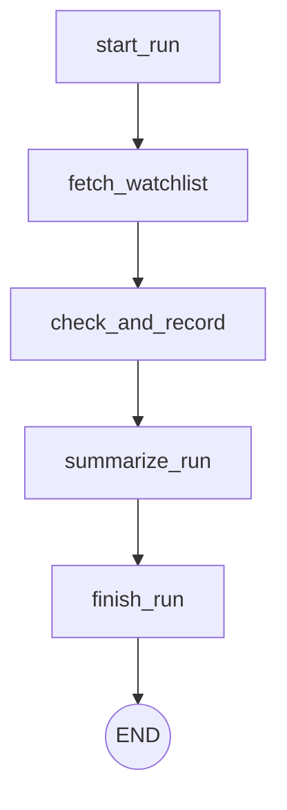

# Inventory Intel Agent

The Inventory Intel Agent is a full-stack, MCP-powered agentic system that autonomously monitors product prices and stock across e-commerce retailers, stores historical data, and alerts on meaningful changes. Built with FastAPI, Next.js, and LangGraph, it provides a complete end-to-end solution for inventory tracking.

## Architecture



## Tech Stack
- **Backend Framework**: FastAPI (Python)
- **Database**: PostgreSQL with Alembic migrations and SQLAlchemy ORM
- **Frontend**: Next.js 14, Tailwind CSS, Recharts
- **Agent Orchestration**: LangGraph
- **LLM Integration**: LangChain OpenAI (`gpt-4o-mini`)
- **Tools Protocol**: Model Context Protocol (MCP). *The MCP Server is explicitly designed as a reusable, protocol-verified component, exposing core scraping and DB functions to any compatible agent.*
- **Scheduler**: APScheduler with database locks
- **Alerting**: Slack webhooks

## Highlights
- **Real MCP Protocol Verification**: The project implements and verifies a genuine Model Context Protocol server (`FastMCP`), exposing tools natively.
- **Genuine LLM Reasoning Step**: The LLM is used purely for high-level synthesis (summarizing the run trace), while keeping scraping and database writes deterministic.
- **Self-Healing Scheduler**: A standalone scheduler worker that prevents overlapping jobs and recovers from stale DB locks.
- **Eval Harness**: Includes synthetic LLM evals using `pytest` to evaluate summary generation.

## Setup Instructions

### Option A: Docker Compose (Recommended)
You can run the entire stack (Database, API + MCP server, Scheduler, and Dashboard) using Docker Compose. Ensure you have Docker and Docker Compose installed.

1. Ensure your `.env` file is populated at the project root.
2. Run the stack:
   ```bash
   docker-compose up -d --build
   ```
3. Access the dashboard at `http://localhost:3000` and the API at `http://localhost:8000`.

### Option B: Local Development
1. **Start the Database**:
   ```bash
   docker-compose up -d db
   ```
2. **Set up Python Environment**:
   ```bash
   python -m venv venv
   # On Windows:
   .\venv\Scripts\activate
   # On Unix/macOS:
   # source venv/bin/activate
   pip install -r requirements.txt
   ```
3. **Run the FastAPI Server**:
   ```bash
   uvicorn backend.app.main:app --reload
   ```
4. **Start the Agent Scheduler** (in a new terminal, with venv activated):
   ```bash
   python -m backend.scheduler.run_scheduler
   ```
5. **Run the Next.js Dashboard**:
   ```bash
   cd dashboard
   npm ci
   npm run dev
   ```

## Known Limitations
- **Ubuy JS Rendering**: Ubuy prices are JS-rendered and currently unavailable to our static `BeautifulSoup` parser, so price fields remain `null`.
- **Amazon Bot Defenses**: Amazon occasionally region-restricts products or serves CAPTCHA/bot-challenge pages under heavy use. This is handled gracefully by the agent (logging the error and continuing), but live scraping cannot always be guaranteed on-demand.
- **MCP SDK v1.x**: The MCP server uses `FastMCP` (SDK v1.x) to maintain compatibility with `langchain-mcp-adapters`, pending support for SDK v2.
