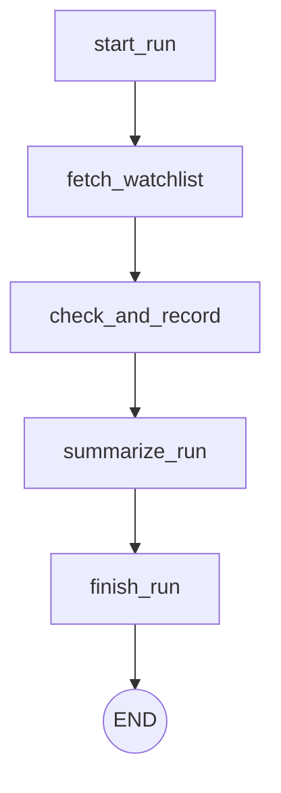

# Agent Orchestration Design

## Architecture

The orchestration engine uses **LangGraph** to process product inventory tasks in a structured workflow. It directly invokes tools exposed by the **MCP Server** via `langchain-mcp-adapters`.

### Nodes and Edges

1. **`start_run`**: Calls `start_agent_run` MCP tool to create a new `AgentRun` tracking row in PostgreSQL and retrieve the `run_id`.
2. **`fetch_watchlist`**: Calls `list_watchlist` MCP tool to fetch all active products being tracked.
3. **`check_and_record`**: A parallel `Send` (map-reduce) execution pattern that runs for each product in the watchlist. It orchestrates three MCP tool tasks per product:
   - Evaluates current status via `check_amazon_price` or `check_ubuy_stock`.
   - Fetches recent stock/price constraints via `get_price_history` and `get_stock_history`.
   - Invokes `record_price_check` and `record_stock_check` to push changes to the DB.
4. **`summarize_run`**: Makes a real OpenAI API call (`gpt-4o-mini`) using `langchain_openai`. Passes the aggregated JSON trace of all `check_and_record` results to the LLM. The LLM acts purely as an analyzer here, producing a human-readable 2-4 sentence summary of the run's activity.
5. **`finish_run`**: Calls `finish_agent_run` to commit the run status, total products checked, and full JSON trace (including the LLM summary) back to PostgreSQL.

### Technology Stack & Integrations

- **LangGraph**: Used `langgraph` v1.2.11 for orchestration and mapping patterns (`Send`).
- **MCP Adapter**: Used `langchain-mcp-adapters` v0.3.2 to abstract stdio server parameters and bridge FastMCP's raw outputs into standard dicts via a custom `parse_mcp_result` hook.
- **LLM Summary Call**: Located in `summarize_run` node. Invoked once per agent run (to minimize tokens and API calls), acting strictly to build summaries over known data traces, leaving tools orchestration to deterministic code since the logic is deterministic.

### Known Trade-offs

- **MCP SDK v1.x vs v2**: In Phase 4b, the server was built and verified using the official MCP SDK v2 (i.e. `MCPServer`). However, as of this build, `langchain-mcp-adapters` pins the requirement to `mcp<2.0.0`. To allow the LangGraph integration to work in Phase 5, the server was downgraded and reverted to using `FastMCP` (SDK v1.x). The exact import line in `backend/mcp_server/server.py` is currently: `from mcp.server.fastmcp import FastMCP`. This trade-off should be revisited and upgraded once the adapter library supports SDK v2.
